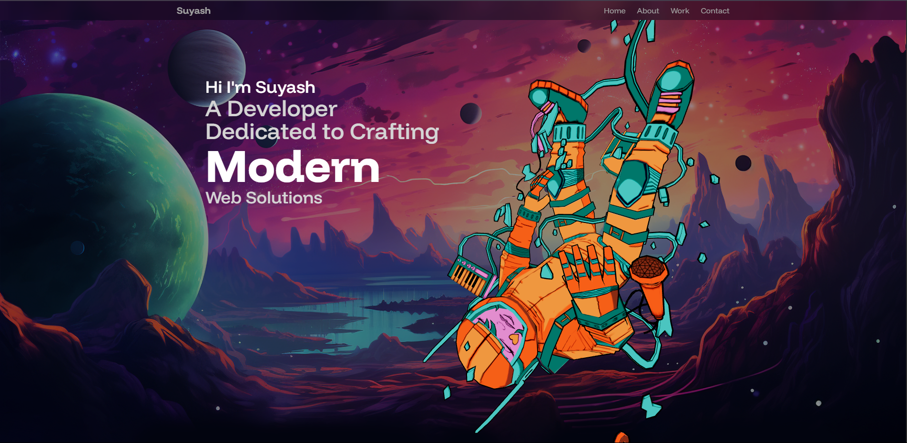

# 🚀 3D Developer Portfolio



A modern, animated 3D developer portfolio built with React, Three.js, TailwindCSS, and motion effects — designed to help you stand out and showcase your skills creatively.

---

## 📚 Table of Contents

- [Features](#-features)
- [Tech Stack](#-tech-stack)
- [Project Structure](#-project-structure)
- [Getting Started](#-getting-started)
- [Assets](#-assets)
- [Contact Me](#-contact-me)
- [Suggestions or Feedback](#-suggestions-or-feedback)
- [Like This Project?](#-like-this-project)

---

## ✨ Features

- 🔥 3D visuals powered by **React Three Fiber** and **Drei**
- ⚡ Smooth transitions and scroll-based animations using **Framer Motion**
- 🎨 Clean, responsive UI with **TailwindCSS**
- 💌 Working contact form using **EmailJS**
- 🧱 Beautiful UI enhancements with **Aceternity UI** and **Magic UI**
- 🚀 Lightning-fast development with **Vite**

---

## 🛠 Tech Stack

| Tech              | Description                           |
|-------------------|---------------------------------------|
| React             | Front-end JavaScript library          |
| Vite              | Fast bundler and dev environment      |
| TailwindCSS       | Utility-first CSS framework           |
| React Three Fiber | 3D rendering with Three.js in React   |
| Drei              | Helpers and abstractions for R3F      |
| Framer Motion     | Animation library for React           |
| EmailJS           | Form handling and email integration   |
| Aceternity UI     | Custom UI components                  |
| Magic UI          | Prebuilt UI elements and design extras|

---

## 📁 Project Structure

```bash
├── public/
│   ├── assets/             # Images, textures, models
│   ├── models/             # 3D Astronaut model
│   └── vite.svg
├── src/
│   ├── components/         # Reusable components
│   ├── constants/          # Reusable datas
│   ├── sections/           # Portfolio sections (Hero, About, etc.)
│   ├── App.jsx             # Main app file
│   ├── index.css           # Tailwind css
│   └── main.jsx            # Entry point
├── tailwind.config.js
└── vite.config.js
```

---

## 🚀 Getting Started
1. Clone the Repository
```bash
git clone https://github.com/Subh0115/Suyash_Portfolio.git
cd Suyash_Portfolio
```
2. Install Dependencies
```bash
npm install
```
3. Run the Development Server
```bash
npm run dev
```
The app will be available at http://localhost:5173.

---

## 🔗 Assets
Assets used in the project can be found in the `public/assets/` directory.

---

## 📬 Contact Me
[](https://www.linkedin.com/in/suyash-ahire-423b3b353)
[](https://github.com/Subh0115)
[](https://wa.me/918433632044)

**Email:** suyash2004.ahire@gmail.com

---

## 💡 Suggestions or Feedback?
Open an issue here on GitHub or connect with me on LinkedIn.<br/>
👉 What should I build next?

- A beautiful Landing Page
- A complete E-commerce site
- A fun App Clone (YouTube, Netflix, etc.)
- Or another interactive Portfolio

Let me know!

---

## ⭐ Like This Project?
Star the repo and connect with me for more dev content!
